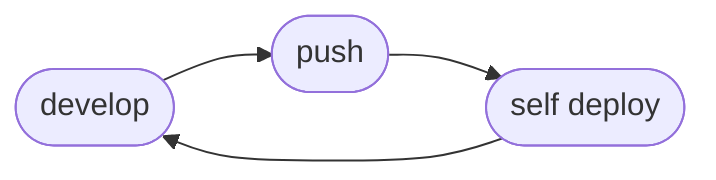

# Continuous Integration

Self ties into Continuous Integration as a final step in the pipeline, publishing the release to ECR. This removes the need to run `self publish` from our development flow graph, but still leaves deployment on the developer as a responsibility.

## Flow



### AWS/GitHub OIDC Trust

> **Note**
> Admin is given to the OIDC role here for expedience of documentation. This will be corrected in short order.

```terraform
# within your infrastructure terraform

data "aws_iam_policy" "api_gw_admin" {
  # Scope down to custom policy allowing API Gateway read only, won't be required in futute release.
  arn = "arn:aws:iam::aws:policy/AmazonAPIGatewayAdministrator"
}

data "aws_iam_policy" "ecr_admin" {
  # Scope down to custom policy allowing image push, tag, and untag.
  arn = "arn:aws:iam::aws:policy/AmazonEC2ContainerRegistryFullAccess"
}

module "github-oidc-provider" {
  source  = "terraform-module/github-oidc-provider/aws"
  version = "2.2.1"
  create_oidc_role = true
  role_name = "github-oidc-role"

  oidc_role_attach_policies = [
    data.aws_iam_policy.api_gw_admin.id,
    data.aws_iam_policy.ecr_admin.id,
  ]

  repositories = [
    # populate with gihub repositories you wish the role to be assumable within.
    # "org/repo",
    # "user/repo"
  ]
}
```

### GitHub Actions

#### On PR and Merge
This GitHub Actions workflow...
1. Runs on all PRs and Merge events to `main`.
1. Installs Self from latest tag.
1. Assumes the OIDC role for Self to use.
1. Runs a placeholder echo for your tests.
1. Publishes the release to ECR tagged with branch and sha.

```yaml
# ./github/workflows/publish.yml
name: ci
on:
  pull_request:
  push:
    branches:
      - main

env:
  RELEVANT_GIT_BRANCH: ${{ github.head_ref || github.ref_name }}
  RELEVANT_GIT_SHA: ${{ github.event_name == 'pull_request' && github.event.pull_request.head.sha || github.sha }}

jobs:
  test-publish:
    runs-on: ubuntu-latest
    permissions:
      id-token: write
      contents: read
    strategy:
      matrix:
        function: [./path/to/function] # populate with repo function paths.
    steps:
        - uses: actions/checkout@v4

        - name: Install self
          uses: linecard/self-action@main
          with:
            version: latest

        - name: Configure AWS Credentials
          uses: aws-actions/configure-aws-credentials@v4
          with:
            role-to-assume: arn:aws:iam::${AWS_ACCOUNT_ID}:role/github-oidc-role
            aws-region: us-west-2

        - name: Test
          run: echo "run tests against your code here"

        - name: Publish
          run: |
            cd ${{ matrix.function}}
            self publish \
              --ecr-login \
              --ensure-repository \ # Remove if you intend to manually create repositories.
              --branch ${{ env.RELEVANT_GIT_BRANCH }} \
              --sha ${{ env.RELEVANT_GIT_SHA }}
```

### On Branch Delete
This GitHub Actions workflow...
1. Runs on all branch delete events.
1. Installs Self from latest tag.
1. Assumes the OIDC role for Self to use.
1. Removes the branch name tag from the release in ECR.

```yaml
# ./github/workflows/untag.yml
name: untag
on: delete

jobs:
  untag:
    if: github.event.ref_type == 'branch'
    runs-on: ubuntu-latest
    permissions:
      id-token: write
      contents: read
    strategy:
      matrix:
        function: [./path/to/function] # populate with repo function paths.
    steps:
      - uses: actions/checkout@v3

      - name: Configure AWS Credentials
        uses: aws-actions/configure-aws-credentials@v4
        with:
          role-to-assume: arn:aws:iam::${AWS_ACCOUNT_ID}:role/gh-actions-ecr-access
          aws-region: us-west-2

      - name: Install self
        uses: linecard/self-action@main
        with:
          version: latest

      - run: |
          cd ${{ matrix.function}}
          self untag --branch ${{ github.ref }}
```