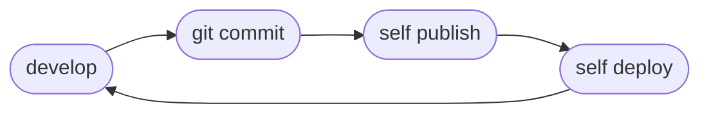

# Local

Self can be used without any CI/CD integration. This scenario reprisents the most basic usage of Self, but also the usage which keeps our developer flow graph in the most complex state.

## Flow



### Develop

Self can initialize functions scaffolds for you. In this example we will initialize a python based function.

```
self init python echo-headers
```

### Commit

Self will refuse to publish new images when the branch is dirty.

```
git commit -m "exploring self"
```

### Publish

Self can optionally login to ECR using your AWS credentials and optionally ensure a repository exists for the function.

```
self publish --ecr-login --ensure-repository
```

### Deploy

```
self deploy
```

### :tada:

```
self deployments
```

### Cleanup

```
self destroy
```