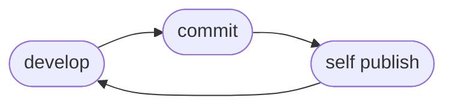

# Continuous Deployment

Self achieves continuous deployment by existing as a deployed release which listens to ECR `PUSH` and `DELETE` events. This removes the need to run `self deploy` from our development flow graph, but still leaves publishing on the developer as a responsibility.

## Flow



## Deploy Self with Self

```bash
self init self continuous-deployment
cd continuous-deployment
self publish --ecr-login --ensure-repository
self deploy

self enable # this will enable the lambda to begin continuously deploying.
self disable # this will disable the lambda from continuously deploying.
```

## Otel

When operating within a lambda, `Self` is able to send telemetry to an Otel collector. This is done by configuring the...

- `OTEL_EXPORTER_OTLP_ENDPOINT`
- `OTEL_EXPORTER_OTLP_HEADERS`
- `OTEL_SERVICE_NAME`

...environment variables. See [environment](/2_factor/environment) for setting these envars in the Lambda.
