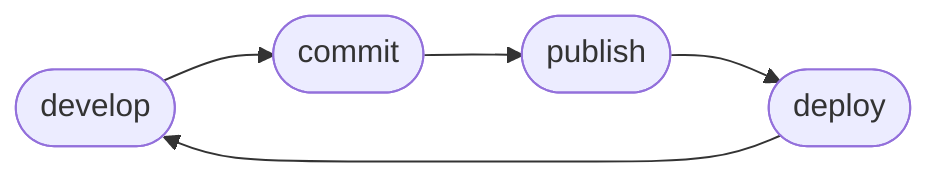

# Quick Start

Self is primarily designed to be a CI/CD tool, automatically deploying and destroying functions in tight correlation with the git branches from which they originate. However, as an operator, the CLI provides a way to both manage and better understand the workings of Self. So let's start here.

## Flow



### Develop

Self can initialize functions scaffolds for you. In this example we will initialize a python based function.

```
self init python echo-headers
```

### Commit

Self will refuse to publish new images when the branch is dirty.

```
git commit -m "exploring self"
```

### Publish

Self can optionally login to ECR using your AWS credentials and optionally ensure a repository exists for the function.

```
self publish --ecr-login --ensure-repository
```

### Deploy

```
self deploy
```

### :tada:

```
self deployments
```

### Cleanup

```
self destroy
```